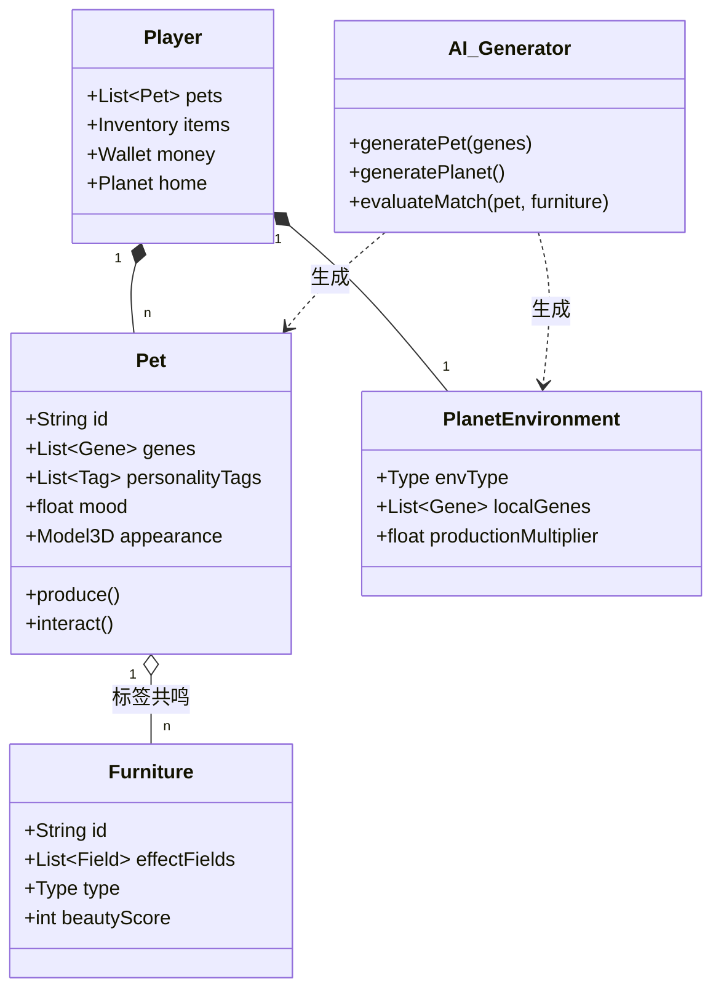

# 玩法方案1：架构图解

本文档为 `玩法方案1.md` 的补充图解，包含核心循环、经济系统及系统架构的可视化描述。

## 1. 核心玩法循环 (Core Loop)

```mermaid
graph TD
    %% 节点定义
    Start((开始)) --> Explore[星际拾荒<br/>(一键导航/扫描)]
    Explore -->|获得| Gene[基因图谱] & Bio[生物质]
    
    Gene & Bio --> Generate[AI 伙伴入住<br/>(基因混合/预览微调)]
    
    Generate --> Build[家园建设<br/>(策略装修/标签共鸣)]
    
    Build -->|提升| Mood[宠物心情]
    Build -->|吸引| Visitor[NPC 访客]
    
    Mood -->|产出| Gift[专属产物/谢礼]
    Visitor -->|支付| Ticket[门票/小费]
    
    Gift & Ticket -->|出售| Money[星际币]
    
    Money -->|购买| Furniture[功能性家具/装饰]
    Furniture --> Build
    
    subgraph 社交循环
    Dispatch[星际派遣<br/>(好友串门)] -->|环境共鸣| DoubleGift[双倍礼物]
    Dispatch -->|基因采集| EnvGene[环境基因图谱]
    EnvGene --> Generate
    DoubleGift --> Money
    end
    
    Generate --> Dispatch
```

## 2. 经济循环 (Economy Loop)

```mermaid
flowchart LR
    subgraph 资源获取 (Source)
    P1[宠物谢礼]
    P2[访客门票]
    P3[派遣收益]
    end
    
    subgraph 货币转化 (Currency)
    Money((星际币))
    end
    
    subgraph 资源消耗 (Sink)
    S1[购买家具/装饰]
    S2[扩建房间]
    S3[购买玩具]
    end
    
    subgraph 价值验证 (Value)
    V1[更高的宠物心情]
    V2[更美的家园展示]
    V3[解锁特殊动作]
    end
    
    P1 & P2 & P3 -->|出售| Money
    Money -->|消费| S1 & S2 & S3
    S1 -->|产出| P1
    S1 -->|吸引| P2
    S3 -->|提升| V3
    S1 & S2 -->|提升| V1 & V2
```

## 3. 系统架构概览 (System Architecture)


