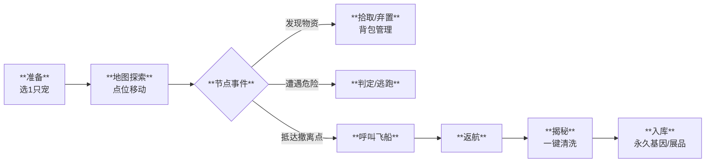

# 阶段1：星际拾荒 (Exploration)

## 1. 核心体验 (Core Experience)
**“点对点探险，背包大挑战”**
借鉴《双点博物馆》的探险地图模式，玩家操控宠物在**连接的点位 (Nodes)** 之间移动。
*   **体验目标**：在“贪婪”与“安全”之间做权衡，享受满载而归的成就感。

## 2. 玩法流程 (Gameplay Flow)

---

## 3. 核心机制 (Key Mechanics)

### 3.1 极简筹备
*   **单宠机制**：每次探险仅需携带**1只宠物**。
*   **环境匹配**：
    *   **Buff**：带 [火系] 宠去 [火山] $\rightarrow$ 移动消耗降低，危险判定成功率提升。
    *   **Debuff**：带 [水系] 宠去 [火山] $\rightarrow$ 移动速度变慢，容易触发负面事件。

### 3.2 节点地图规则
*   **地图结构**：由**起始点**、**连接线**和**未知节点**构成的网络。
*   **迷雾机制**：未探索区域被迷雾覆盖，玩家只能看到当前节点相邻的下一步，保持探索的未知感。
*   **风险递增**：随着探索步数增加，地图的**危险指数**（如沙暴等级）会逐渐上升。玩家走得越远，遭遇危险的概率越高，迫使玩家在“继续深入”和“见好就收”之间做决策。

### 3.3 背包管理 (Tetris-lite)
*   **格子限制**：宠物背包空间有限（例如：小型宠3格，大型宠5格）。
*   **物品尺寸**：
    *   `小包裹` (1格)：通常是基础资源。
    *   `中包裹` (2格)：通常是图纸或稀有矿石。
    *   `巨大遗物` (4格)：极大概率开出稀有基因或传说展品。
*   **决策时刻**：当背包已满时，如果发现了新的高价值物品，玩家必须选择**丢弃**背包里现有的物品，或者**放弃**眼前的宝物。

### 3.4 惊喜揭秘
*   **自动清洗**：回到基地后，带回的“脏包裹”需要通过清洗机处理。
*   **永久基因**：
    *   **一次性解锁**：基因一旦获得即永久解锁，后续生成宠物不再消耗基因物品。
    *   **重复转化**：如果开出已拥有的基因，会自动转化为大量通用资源（生物质）。

---

## 4. 节点类型设计

| 图标 | 类型 | 玩法逻辑 |
| :--- | :--- | :--- |
| 🏠 | **起始/撤离** | 飞船降落点，也是唯一的安全撤离点（除非在地图深处发现隐藏信标）。 |
| 📦 | **物资点** | 发现包裹，触发背包整理界面。 |
| ⚠️ | **危险点** | 遭遇环境灾害或野兽。系统根据宠物属性进行判定（如：力量>5），判定失败则丢失物品或被迫后退。 |
| 👁️ | **奇遇点** | 纯文字剧情交互，提供临时Buff或特殊道具。 |
