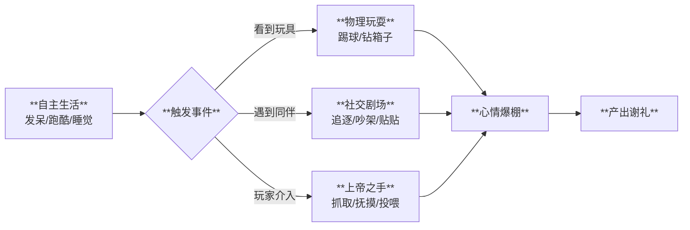

# 阶段4：生活与互动 (Life & Interaction)

## 1. 核心体验 (Core Experience)
**“从电子鱼缸到 AI 幼儿园”**
家园是一个**基于物理和 AI 的沙盒游乐场**。
*   **体验目标**：观察宠物们自发的、混乱的、有趣的日常生活，以及作为“上帝”介入其中的乐趣。

## 2. 玩法流程 (Gameplay Flow)

---

## 3. 核心机制 (Key Mechanics)

### 3.1 自主行为逻辑
*   **性格驱动**：宠物的日常行为完全由性格标签决定。
    *   [多动症]：会在家园里跑酷 (Zoomies)，无法安静下来。
    *   [懒癌]：喜欢像液体一样瘫倒在地板上，移动缓慢。
    *   [好奇]：会尾随扫地机器人，或者盯着新家具看。
*   **拒绝站桩**：宠物永远在做着符合其性格的事情，而不是呆立不动。

### 3.2 物理沙盒
*   **实体玩具**：引入物理引擎，玩具具有真实的物理属性。
    *   *瑜伽球*：高弹力，宠物跳上去会被弹飞。
    *   *纸箱山*：轻量级，容易被撞倒，宠物可以钻进去。
*   **真实碰撞**：互动充满意外性，宠物可能会被球绊倒，或者卡在箱子里求救。

### 3.3 上帝之手
玩家可以直接介入物理世界与宠物互动：
*   **抓取**：长按拎起宠物的后颈皮（宠物会在空中挣扎）。
*   **投掷**：轻轻把宠物丢到床上，或者丢进温泉里溅起水花。
*   **抚摸**：快速摩擦屏幕，宠物身上冒出爱心。
*   **逗宠**：使用激光笔道具，指引宠物跑动。

---

## 4. 社交剧场

系统会自动演算宠物之间的互动关系：
*   **玩伴**：两只性格相投的宠物会互相追逐（鬼抓人）。
*   **模仿**：幼年宠物会模仿成年宠物的动作（如伸懒腰）。
*   **冲突**：属性相克的宠物可能发生小摩擦（如火系烧到了草系），需要玩家安抚。
*   **Meme 时刻**：系统自动抓拍精彩瞬间（如三只宠物叠罗汉睡觉），生成“每日拍立得”。
