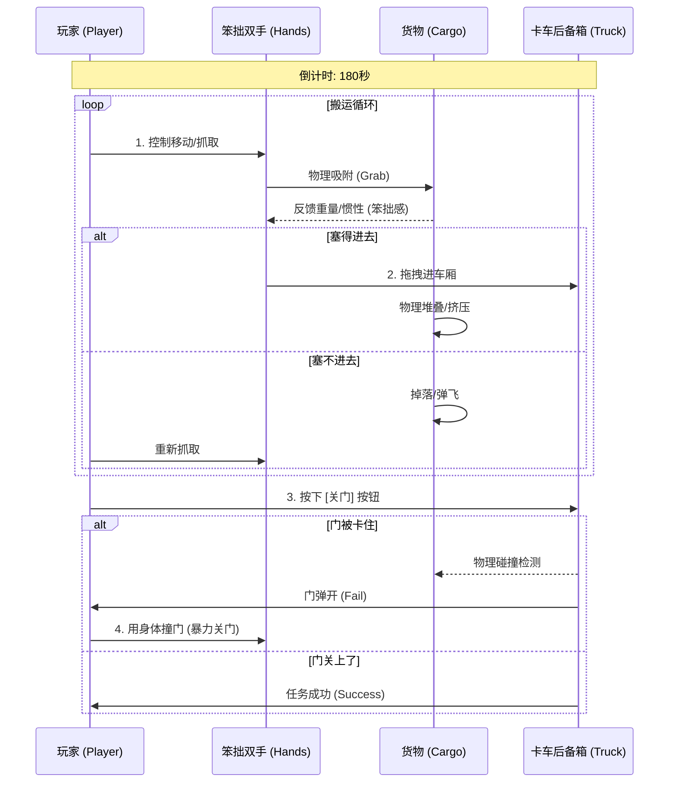
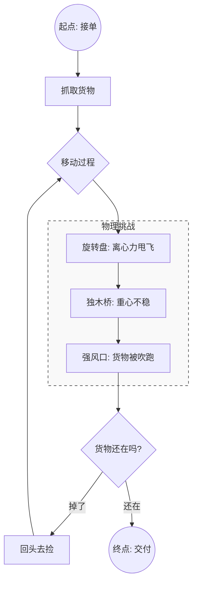

# 🎮 玩法可视化：SimPets 物理派对 (Gameplay Visualization)

> **用途**：用于团队内部快速对齐玩法思路。不包含局外循环，仅聚焦于**关卡内的核心体验**。

## 1. 五大玩法核心机制对比 (Core Mechanics Matrix)

```mermaid
mindmap
  root((核心玩法库))
    (方案3: 极限装车<br>Wobbly Packer)
      ::icon(fa fa-star)
      [核心动作: 堆叠 + 挤压]
      [操作焦点: 原地抓取]
      [胜利条件: 强行关上门]
      [开发成本: ⭐⭐⭐⭐⭐ (极低)]
      [体验: 强迫症爽感]
    (方案1: 软体快递<br>Jelly Express)
      [核心动作: 跑酷 + 平衡]
      [操作焦点: 移动 + 双手抓]
      [胜利条件: 抵达终点]
      [开发成本: ⭐⭐⭐ (中)]
      [体验: 跌跌撞撞]
    (方案2: 笨贼妙手<br>Clumsy Heist)
      [核心动作: 潜行 + 避障]
      [操作焦点: 微操控制]
      [胜利条件: 噪音条未满]
      [开发成本: ⭐⭐ (高)]
      [体验: 紧张滑稽]
    (方案4: 灾难求生<br>Survival Drill)
      [核心动作: 抓取 + 反应]
      [操作焦点: 死按住不放]
      [胜利条件: 存活倒计时]
      [开发成本: ⭐⭐⭐⭐ (低)]
      [体验: 劫后余生]
    (方案5: 软体清洁工<br>Clumsy Janitor)
      [核心动作: 工具 + 互动]
      [操作焦点: 挥动拖把]
      [胜利条件: 垃圾归位]
      [开发成本: ⭐ (极高)]
      [体验: 越帮越忙]
```

---

## 2. 推荐方案 (方案3) 详细交互流程

**方案：极限装车 (Wobbly Packer)**
*   **场景**：一辆后备箱敞开的卡车 + 一地散落的家具。
*   **目标**：把东西塞进去，关上门。



---

## 3. 备选方案 (方案1) 详细交互流程

**方案：软体快递 (Jelly Express)**
*   **场景**：一条充满物理机关的赛道。
*   **目标**：抱着货物活着走到终点。


